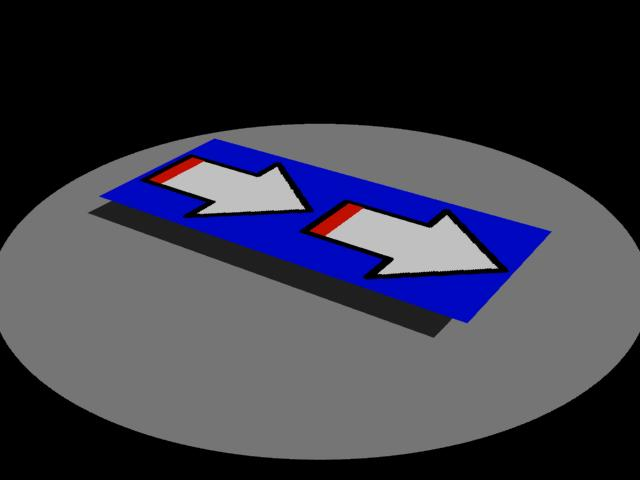
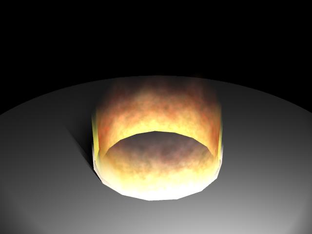
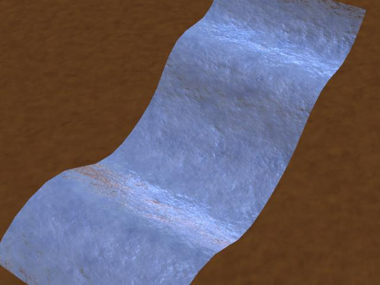
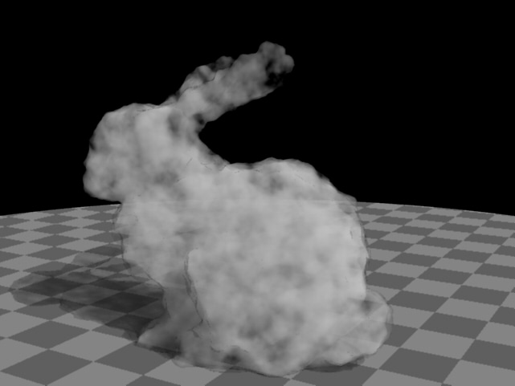
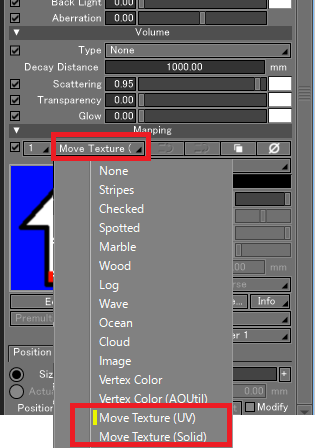
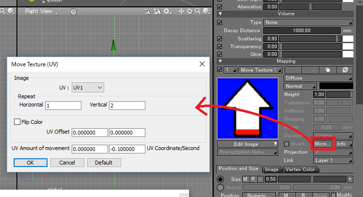
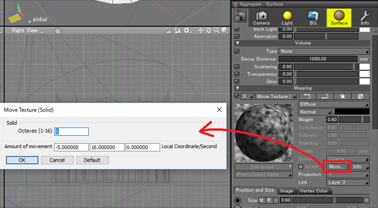
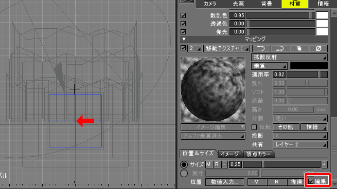

I translate it using "Google Translate"...  

# MoveTexture for Shade3D

MoveTexture Plugin is Shade3D's Shader plugin for assigning animated texture (UV, solid) to surface material mapping layer.  
As a Shader element of the mapping layer you can add "Move Texture (UV)" for UV mapping and "Move Texture (Solid)" of cloudy solid texture.  

## System Requirements

* Windows 7 / 8 / 8.1 / 10 
* Mac OS 10.11.x / 10.12.x
* Shade3D Standard/Professional ver.16(64bit) or later.Shade3D Basic is not supported.

The sample shd uses the function of Shade 3D ver.16.  

## Plugin binary

The release build of the plugin is placed below.  

https://github.com/ft-lab/Shade3D_plugin_MoveTexture/releases

## Build the source (for development)

Windows uses Visual Studio 2017.  
Mac uses Xcode 10.1.  
Shade3D Plugin SDK ver.15.1 is required to build ( https://shade3d.jp/community/sdn/sdk.html ).  

## Build method (for development)

Download Shade3D Plugin SDK ver.15.1.  
Place the "MoveTexture" directory of the source downloaded with "Shade3D_plugin_MoveTexture" in the "plugin_projects" directory of Shade3D Plugin SDK.  

### Windows

Start Visual Studio 2017, build "MoveTexture/win/Template.sln" and build it.  

### Mac

Start up Xcode 10.x and load "MoveTexture/mac/plugins/Template.xcodeproj" and build it.  

## Using MoveTexture Plugin

### Windows

In Windows, copy MoveTexture64.dll (MoveTexture.dll if using 32 bit Windows) to the following folder, and then restart Shade3D:  
C:¥Users¥(your user name)¥Documents¥Shade3D¥Shade3D ver.16¥plugins  
(C:¥Users¥(your user name)¥Documents is your 'My Documents' folder. This location may differ according to your system.)   

Confirm that "Move Texture (UV)" and "Move Texture (Solid)" are in the mapping layer of the Surface window.  

### Mac

In Mac, copy MoveTexture64.shdplugin to the following folder, and then restart Shade3D:  
Users/(your user name)/Documents/Shade3D/Shade3D ver.16/plugins  

Confirm that "Move Texture (UV)" and "Move Texture (Solid)" are in the mapping layer of the Surface window.  

## Sample shd

This is a sample scene using texture movement. Please check by animation rendering.  
The sample scene is put below.  
https://github.com/ft-lab/Shade3D_plugin_MoveTexture/tree/master/samples  

### MoveTexture_sample1.shd

A sample scene that assigns "Move Texture (UV)" to the mapping layer of surface and moves it by animation rendering.    
      

### MoveTexture_fire.shd

A sample scene that assigns "Move Texture (Solid)" to the mapping layer of surface and moves it by animation rendering.  
It expresses like a flame by overlapping multiple layers.  
      

### MoveTexture_water.shd

A sample scene that assigns "Move Texture (UV)" to the mapping layer of surface and moves it by animation rendering.  
By superimposing multiple layers of diffuse reflection and bumps, we express like water flow.  
      

### MoveTexture_volume.shd
A sample scene that assigns "Move Texture (Solid)" to the mapping layer of surface and animates volume rendering.    
    

## How to use

"Move Texture" refers to the shift movement of mapped image / noise solid textures (like clouds and spots) in animation rendering.  
This plugin is a "Shader plugin" specified as a mapping layer of surface.  
You can select "Move Texture (UV)" or "Move Texture (Solid)" as the mapping layer.    
      
Complex expressions can be done by overlapping multiple layers.  

### "Move Texture (UV)"

If you select "Move Texture (UV)" in the mapping layer of the surface, the moving texture layer with the image specified is specified.    
     

Please press the "Edit Image" button and add the image to be referenced by the layer.  
The color of the layer. "Diffuse" "Bump" and other types of switching. "Weight" can be used.  
Press the "More" button to open the setting dialog box.  
"UV" is the reference UV layer (UV1 / UV2 only).  
In "Repeat", specify the number of repetitions of horizontal and vertical.  
"Flip Color" reverses the color of the texture.  
"UV Offset" specifies the amount by which the texture is shifted during rendering by UV coordinates (0.0 - 1.0).  
By shifting offsets, it makes less noticeable that you are using the same texture when referring to the same texture.  
"UV Amount of movement" is the shift amount at UV coordinates (0.0 - 1.0) when 1 second elapses in animation rendering. This will animate the shift movement.  

### "Move Texture (Solid)"

If you select "Move Texture (Solid)" in the mapping layer of the surface, the cloud-like solid texture layer is specified.    
     

You can use "Size" and "Position" input on the "Position and Size" tab. This gives us diversity when overlapping multiple layers.  
The color of the layer. "Diffuse" "Bump" and other types of switching. "Weight" can be used.  
Press the "More" button to open the setting dialog box.  
"Octaves" is the number of superimposed solid textures of noise (1-16). If it is large, it is expressed to detail.  
"Amount of movement" is the shift amount in local coordinates when 1 second elapses in animation rendering. This will animate the shift movement.    

"Scale adjustment" group is a function added in ver.1.0.1.0.    
Scale the size of the solid texture in the Y direction.    
This expresses the effect that the noise pattern increases as going upward.   
"Height" specifies the height in which the scale correction is effective in mm units.    
The reference is the origin position in mapping mode. Start at the position 0.0.    
    
"Power" scales curves from the origin Y in mapping mode to the position specified by "height".    
A scale of 1.0 will result in linear scaling, and a scale of 2.0 will result in a sharp increase in scale value as it increases.    
"Scale Value" is the maximum scale value.    
After the specified height, the scale value specified by "Scale Value" is adopted.    

## Version History

[2018/12/28]  ver.1.0.1.0  
* Fixed an issue that attribute specification of solid texture was not saved.    
* Addition of scaling according to height position when using solid texture Addition.    
* Added sample "MoveTexture_volume.shd".

[2017/02/25]  ver.1.0.0.0  
* Initial version 
